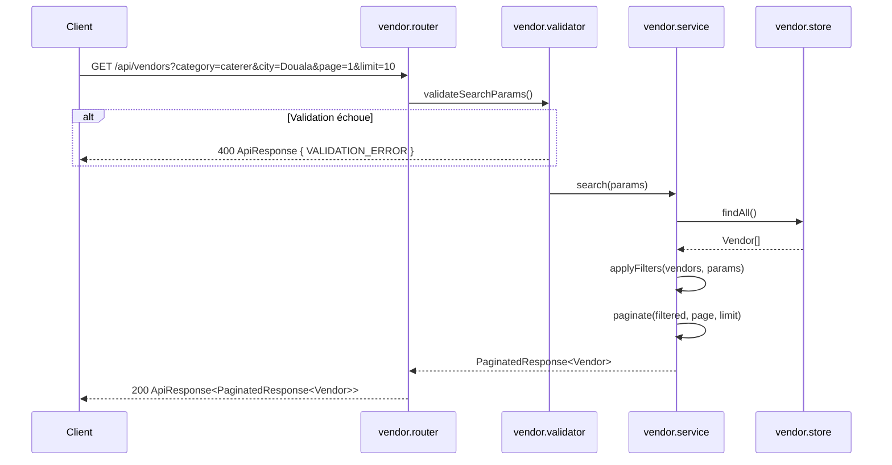
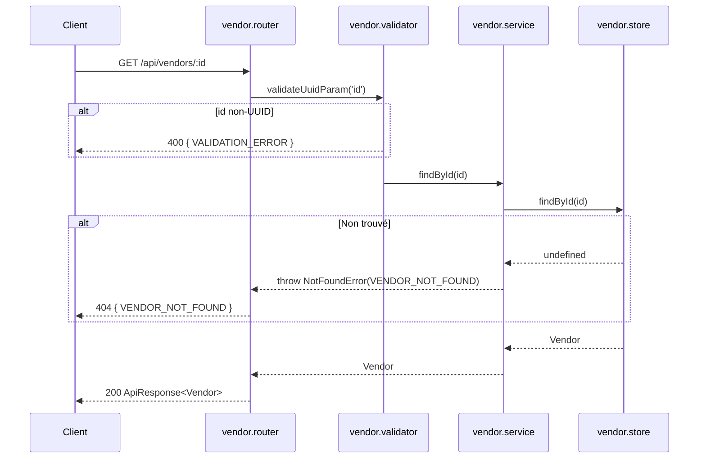
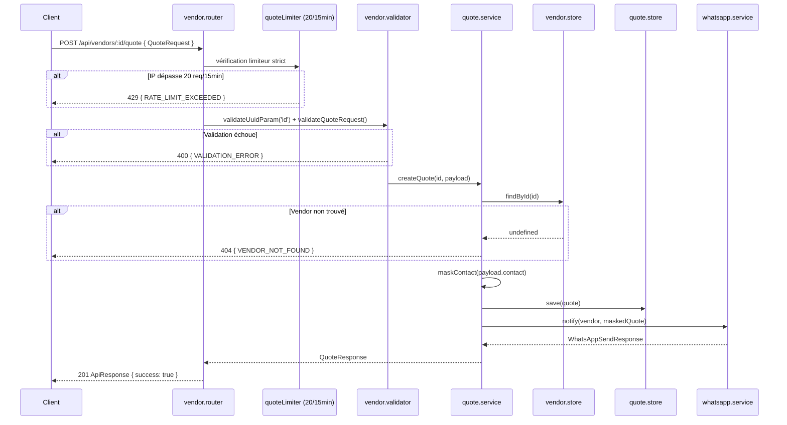
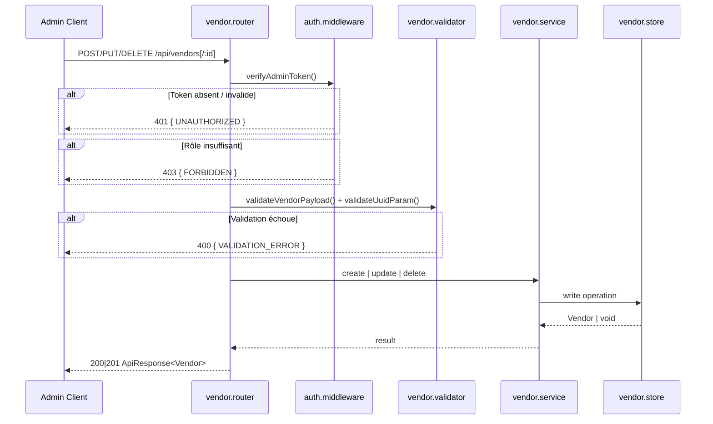

# Document de Conception Technique — Module Vendors

## Overview

Le module **Vendors** expose une API REST pour la recherche, la consultation et le contact de prestataires de services événementiels au Cameroun. Il gère également un CRUD administrateur complet. Toutes les réponses respectent le contrat `ApiResponse<T>` défini dans `shared/types.ts`.

**Routes exposées :**

| Méthode  | Route                        | Accès  | Description                         |
|----------|------------------------------|--------|-------------------------------------|
| `GET`    | `/api/vendors`               | Public | Recherche multicritère paginée      |
| `GET`    | `/api/vendors/:id`           | Public | Détail d'un prestataire             |
| `POST`   | `/api/vendors/:id/quote`     | Public | Demande de devis (limiteur strict)  |
| `POST`   | `/api/vendors`               | Admin  | Création d'un prestataire           |
| `PUT`    | `/api/vendors/:id`           | Admin  | Mise à jour complète                |
| `DELETE` | `/api/vendors/:id`           | Admin  | Suppression avec nettoyage des avis |

**Contraintes techniques non-négociables :**
- Stockage en mémoire : tableau `Vendor[]` (singleton `IVendorStore`) + tableau `Quote[]` (singleton `IQuoteStore`)
- Devise exclusive : XAF (Franc CFA)
- Validation : `express-validator` avant tout traitement métier
- Sécurité : `helmet()` + `express-rate-limit` sur toutes les routes
  - Limiteur global : **100 req / 15 min** par IP
  - Limiteur strict sur `POST /api/vendors/:id/quote` : **20 req / 15 min** par IP
- Réponses : `ApiResponse<T>` systématiquement
- Jamais de stack trace en production (`NODE_ENV=production`)

---

## Architecture

### Structure des fichiers

```
src/modules/vendors/
├── vendor.router.ts          # Définition des routes Express + application des middlewares
├── vendor.validator.ts       # Chaînes de validation express-validator
├── vendor.service.ts         # Logique métier : recherche, CRUD
├── quote.service.ts          # Logique métier : demande de devis + notification
├── vendor.store.ts           # Stockage en mémoire (catalogue Vendor[])
├── quote.store.ts            # Stockage en mémoire (demandes de devis Quote[])
└── index.ts                  # Barrel export du module

src/shared/
├── types.ts                  # Interfaces centrales (Vendor, Quote, QuoteRequest, etc.)
├── errors.ts                 # Classes d'erreurs métier (AppError, NotFoundError…)
└── middlewares/
    ├── auth.middleware.ts     # Vérification du rôle admin
    ├── validate.middleware.ts # Exécution des chaînes express-validator
    └── error.middleware.ts    # Global error handler
```

### Responsabilités par couche

```
Request HTTP
    │
    ▼
[vendor.router.ts]
  - Monte les middlewares de sécurité (helmet, rateLimiter global ou strict)
  - Orchestre : validator → authMiddleware (admin) → handler
  - Délègue au service approprié
    │
    ▼
[vendor.validator.ts]
  - Valide et sanitise TOUS les inputs (query, params, body)
  - Retourne 400 + VALIDATION_ERROR si invalide
  - Ne touche pas à la logique métier
    │
    ▼
[vendor.service.ts / quote.service.ts]
  - Applique les règles métier
  - Lit/écrit dans vendor.store.ts (IVendorStore)
  - Lit/écrit dans quote.store.ts (IQuoteStore)
  - Lance des AppError pour les cas d'erreur (VENDOR_NOT_FOUND…)
  - Délègue la notification à quote.service.ts
    │
    ▼
[vendor.store.ts / quote.store.ts]
  - Tableaux en mémoire : Vendor[] et Quote[]
  - Opérations CRUD atomiques
  - Génère les UUID v4 (via crypto.randomUUID())
```

### Diagramme de flux — Recherche (GET /api/vendors)



### Diagramme de flux — Détail (GET /api/vendors/:id)



### Diagramme de flux — Demande de devis (POST /api/vendors/:id/quote)



### Diagramme de flux — CRUD Admin



---

## Components and Interfaces

### Interfaces étendues (à ajouter dans `shared/types.ts`)

```typescript
/**
 * Paramètres de recherche étendus pour les prestataires.
 * Étend VendorSearchParams avec les filtres de prix et la pagination.
 */
export interface VendorExtendedSearchParams extends VendorSearchParams {
  /** Prix minimum de la fourchette (en XAF, entier positif) */
  minPrice?: number;
  /** Prix maximum de la fourchette (en XAF, entier positif) */
  maxPrice?: number;
  /** Numéro de page (>= 1, défaut : 1) */
  page?: number;
  /** Nombre d'éléments par page (1-100, défaut : 20) */
  limit?: number;
}

/**
 * Demande de devis envoyée par un client vers un prestataire.
 */
export interface QuoteRequest {
  /** Nom complet du client (2-100 caractères) */
  clientName: string;
  /**
   * Contact du client : email RFC 5322 ou téléphone E.164 +237.
   * Exemple : "client@example.com" ou "+237612345678"
   */
  contact: string;
  /** Description détaillée du besoin (10-1000 caractères) */
  message: string;
  /** Type d'événement (ex. : "Mariage", "Anniversaire", max 100 caractères) */
  eventType: string;
}

/**
 * Demande de devis enregistrée avec métadonnées système.
 */
export interface Quote extends QuoteRequest {
  /** Identifiant unique de la demande (UUID v4) */
  id: string;
  /** Identifiant du prestataire ciblé */
  vendorId: string;
  /** Date de soumission (ISO 8601) */
  createdAt: string;
  /** Contact masqué pour les journaux (numéro tronqué ou email intact) */
  maskedContact: string;
}

/**
 * Codes d'erreur métier spécifiques au module Vendors.
 */
export type VendorErrorCode =
  | 'VENDOR_NOT_FOUND'
  | 'VALIDATION_ERROR'
  | 'UNAUTHORIZED'
  | 'FORBIDDEN'
  | 'RATE_LIMIT_EXCEEDED'
  | 'TOO_MANY_REQUESTS'
  | 'INTERNAL_SERVER_ERROR';
```

### Configuration du Rate Limiting

Le routeur applique **deux limiteurs distincts** :

```typescript
import rateLimit from 'express-rate-limit';

// Limiteur global : toutes les routes du module
export const globalVendorLimiter = rateLimit({
  windowMs: 15 * 60 * 1000, // 15 minutes
  max: 100,
  standardHeaders: true,
  legacyHeaders: false,
  message: {
    success: false,
    errorCode: 'TOO_MANY_REQUESTS',
    message: 'Trop de requêtes, veuillez réessayer dans 15 minutes.',
    timestamp: new Date().toISOString(),
  },
});

// Limiteur strict : POST /api/vendors/:id/quote uniquement
// Prévient les abus de contact en masse vers les prestataires
export const quoteLimiter = rateLimit({
  windowMs: 15 * 60 * 1000, // 15 minutes
  max: 20,                   // 20 req / 15 min par IP (5× plus restrictif)
  standardHeaders: true,
  legacyHeaders: false,
  message: {
    success: false,
    errorCode: 'RATE_LIMIT_EXCEEDED',
    message: 'Limite de demandes de devis atteinte. Réessayez dans 15 minutes.',
    timestamp: new Date().toISOString(),
  },
});
```

**Application dans le routeur :**
```typescript
// vendor.router.ts
router.use(globalVendorLimiter);          // appliqué à toutes les routes
router.post('/:id/quote', quoteLimiter, validateUuidParam, validateQuoteRequest, quoteHandler);
```

> **Décision de conception :** Un limiteur dédié sur la route de devis protège les prestataires contre le spam de contacts. Les 20 req/15min correspondent à un usage légitime intensif tout en bloquant les abus automatisés.

### Contrats de couche — `vendor.validator.ts`

```typescript
// Validation des paramètres de recherche (GET /api/vendors)
export const validateSearchParams: ValidationChain[] = [
  query('category').optional().isIn(['caterer', 'sound', 'decor', 'photo']),
  query('city').optional().isString().trim().notEmpty().isLength({ max: 100 }),
  query('minRating').optional().isFloat({ min: 0.0, max: 5.0 }),
  query('minPrice').optional().isInt({ min: 0 }),
  query('maxPrice').optional().isInt({ min: 0 }),
  query('page').optional().isInt({ min: 1 }),
  query('limit').optional().isInt({ min: 1, max: 100 }),
  // Règle inter-champs : minPrice <= maxPrice
  body().custom(validatePriceRange),
];

// Validation de l'identifiant UUID dans les paramètres de route
export const validateUuidParam: ValidationChain[] = [
  param('id').isUUID(4),
];

// Validation du payload de création/mise à jour (POST & PUT /api/vendors)
export const validateVendorPayload: ValidationChain[] = [
  body('name').isString().trim().isLength({ min: 2, max: 150 }),
  body('category').isIn(['caterer', 'sound', 'decor', 'photo']),
  body('city').isString().trim().isLength({ min: 2, max: 100 }),
  body('priceRange').isString().trim().isLength({ min: 3, max: 100 }),
  body('rating').optional().isFloat({ min: 0.0, max: 5.0 }),
];

// Validation du payload QuoteRequest (POST /api/vendors/:id/quote)
export const validateQuoteRequest: ValidationChain[] = [
  body('clientName').isString().trim().isLength({ min: 2, max: 100 }),
  body('contact').custom(isEmailOrCameroonPhone),
  body('message').isString().trim().isLength({ min: 10, max: 1000 }),
  body('eventType').isString().trim().notEmpty().isLength({ max: 100 }),
];
```

### Contrats de couche — `vendor.service.ts`

```typescript
interface IVendorService {
  /** Recherche paginée avec filtres combinés (AND) */
  search(params: VendorExtendedSearchParams): PaginatedResponse<Vendor>;

  /** Retourne un prestataire par id ou lève VENDOR_NOT_FOUND */
  findById(id: string): Vendor;

  /** Crée un prestataire, génère l'UUID, retourne l'objet complet */
  create(payload: VendorCreatePayload): Vendor;

  /** Remplace intégralement un prestataire ou lève VENDOR_NOT_FOUND */
  update(id: string, payload: VendorCreatePayload): Vendor;

  /**
   * Supprime le prestataire ET ses avis associés
   * (reviews où targetId == id && targetType == 'vendor')
   */
  delete(id: string): void;
}
```

### Contrats de couche — `quote.service.ts`

```typescript
interface IQuoteService {
  /**
   * Enregistre la demande de devis, masque le contact, déclenche la notification.
   * Lève VENDOR_NOT_FOUND si le prestataire n'existe pas.
   */
  createQuote(vendorId: string, payload: QuoteRequest): Quote;

  /**
   * Masque un numéro de téléphone : +237*****XXXX (5 étoiles + 4 derniers chiffres).
   * Règle : le numéro E.164 +237 est suivi de 9 chiffres (13 caractères au total).
   * Exemple : "+237612345678" → "+237*****5678"
   *           (chiffres 5–9 remplacés : positions index 4 à 8 inclus)
   * Si le contact est un email, le retourne intact.
   */
  maskContact(contact: string): string;
}
```

### Contrats de couche — `vendor.store.ts`

```typescript
interface IVendorStore {
  findAll(): Vendor[];
  findById(id: string): Vendor | undefined;
  create(vendor: Vendor): Vendor;
  update(id: string, data: VendorCreatePayload): Vendor | undefined;
  delete(id: string): boolean;
  /** Seed initial pour les tests et le démarrage */
  seed(vendors: Vendor[]): void;
}
```

### Contrats de couche — `quote.store.ts` *(nouveau)*

```typescript
/**
 * Store en mémoire des demandes de devis.
 * Singleton — même cycle de vie que l'application.
 */
interface IQuoteStore {
  /** Persiste une nouvelle demande de devis */
  save(quote: Quote): Quote;
  /** Retourne toutes les demandes pour un prestataire donné */
  findByVendorId(vendorId: string): Quote[];
  /** Retourne une demande par son identifiant, ou undefined */
  findById(id: string): Quote | undefined;
  /** Retourne toutes les demandes enregistrées */
  findAll(): Quote[];
  /** Seed pour les tests */
  seed(quotes: Quote[]): void;
}
```

> **Décision de conception :** Les `Quote` sont stockées dans un store séparé (`quote.store.ts`) plutôt que dans `vendor.store.ts`. Cette séparation des responsabilités facilite les tests unitaires de `quote.service.ts` en isolation, et prépare la migration vers une base de données persistante sans modifier `vendor.store.ts`.

### Considérations de sécurité du module

**Authentification Admin** : le middleware `auth.middleware.ts` vérifie un token statique via `process.env.ADMIN_TOKEN`. Le token n'est jamais loggué ni exposé dans les réponses.

**Protection des données personnelles** : le champ `contact` n'est jamais loggué en clair. Les journaux et les notifications WhatsApp utilisent uniquement `maskedContact`.

**Double protection de la route de devis** : `POST /api/vendors/:id/quote` applique d'abord le `quoteLimiter` (20 req/15min) puis le `globalVendorLimiter` (100 req/15min). En pratique, le `quoteLimiter` est la limite effective.

**Sanitisation** : toutes les chaînes de caractères sont `.trim()`-ées. Les paramètres de query sont castés vers leurs types attendus avant tout traitement métier. La taille des corps de requête est limitée à `10kb`.

---

## Data Models

### Vendor (existant dans `shared/types.ts`)

| Champ        | Type             | Contraintes                                       |
|--------------|------------------|---------------------------------------------------|
| `id`         | `string`         | UUID v4, généré côté serveur                      |
| `name`       | `string`         | Non vide, 2-150 caractères                        |
| `category`   | `VendorCategory` | `caterer` \| `sound` \| `decor` \| `photo`        |
| `city`       | `string`         | Non vide, 2-100 caractères                        |
| `priceRange` | `string`         | Non vide, 3-100 caractères, ex. "50000-150000 XAF"|
| `rating`     | `number`         | `[0.0, 5.0]`, 1 décimale, défaut `0.0`            |

### QuoteRequest (nouveau)

| Champ        | Type     | Contraintes                                               |
|--------------|----------|-----------------------------------------------------------|
| `clientName` | `string` | Non vide, 2-100 caractères                                |
| `contact`    | `string` | Email RFC 5322 **ou** téléphone E.164 commençant par +237 |
| `message`    | `string` | Non vide, 10-1000 caractères                              |
| `eventType`  | `string` | Non vide, max 100 caractères                              |

### Quote (persisté en mémoire via `IQuoteStore`)

| Champ           | Type     | Description                          |
|-----------------|----------|--------------------------------------|
| `id`            | `string` | UUID v4 généré                       |
| `vendorId`      | `string` | UUID du prestataire ciblé            |
| `clientName`    | `string` | Nom du client                        |
| `contact`       | `string` | Contact original (non loggué)        |
| `maskedContact` | `string` | Contact masqué pour les journaux     |
| `message`       | `string` | Contenu de la demande                |
| `eventType`     | `string` | Type d'événement                     |
| `createdAt`     | `string` | Timestamp ISO 8601                   |

### Règle de masquage du contact (`maskContact`)

Un numéro E.164 camerounais a la structure suivante :

```
+237  6  1  2  3  4  5  6  7  8
  ^   ^--9 chiffres après préfixe--^
  préfixe (4 chars)
Total : 13 caractères
```

- Les **5 chiffres intermédiaires** (positions index 4 à 8, soit les chiffres 1 à 5 après `+237`) sont remplacés par `*****`.
- Les **4 derniers chiffres** (positions index 9 à 12) restent visibles.

```
"+237612345678"  →  "+237*****5678"
  préfixe         5 étoiles  4 chiffres
```

```typescript
// Implémentation de référence
function maskContact(contact: string): string {
  if (contact.startsWith('+237') && contact.length === 13) {
    return '+237*****' + contact.slice(-4);
  }
  return contact; // email : inchangé
}
```

> **Cas limites :** tout contact commençant par `+237` mais dont la longueur n'est pas 13 est retourné tel quel (défensive — la validation en amont garantit le format E.164 correct).

### Logique de chevauchement de fourchette de prix

`priceRange` est une chaîne libre (ex. `"50 000 - 150 000 XAF"`). Pour filtrer par `minPrice`/`maxPrice`, le service parse les bornes via la regex :

```
/(\d[\d\s]*)\s*[-–]\s*(\d[\d\s]*)/
```

**Important :** les espaces de milliers (ex. `"50 000"`) doivent être supprimés avant `parseInt` pour éviter les `NaN` :

```typescript
function parsePriceRange(priceRange: string): [number, number] | null {
  const match = priceRange.match(/(\d[\d\s]*)\s*[-–]\s*(\d[\d\s]*)/);
  if (!match) return null;
  // Retirer tous les espaces avant parseInt pour gérer "50 000" → 50000
  const low  = parseInt(match[1].replace(/\s/g, ''), 10);
  const high = parseInt(match[2].replace(/\s/g, ''), 10);
  if (isNaN(low) || isNaN(high)) return null;
  return [low, high];
}
```

Le chevauchement est vérifié par : `parsedMin <= maxPrice && parsedMax >= minPrice` (bornes incluses). Si le parsing échoue, le prestataire est **exclu** du résultat filtré.

### Cohérence et intégrité des données de notation (Exigence 8)

Le champ `rating` est soumis à un invariant strict à **trois niveaux** :

1. **Validation à l'entrée** : `express-validator` rejette tout `rating` hors `[0.0, 5.0]` avec 2 décimales max (création/mise à jour).
2. **Normalisation dans le store** : `vendor.store.ts` arrondit le `rating` à 1 décimale lors de chaque `create` et `update` : `Math.round(rating * 10) / 10`. Cela garantit que les données stockées sont toujours conformes.
3. **Invariant de lecture** : toute réponse de `GET /api/vendors` et `GET /api/vendors/:id` doit satisfaire `rating ∈ [0.0, 5.0]` arrondi à 1 décimale (vérifié par Property 3).

La **règle de filtrage** `minRating` (Exigence 8.2) compare `Math.round(vendor.rating * 10) / 10 >= minRating`, ce qui est toujours cohérent grâce à la normalisation en store.

```typescript
// vendor.store.ts — normalisation à l'écriture
create(vendor: Vendor): Vendor {
  const normalized = {
    ...vendor,
    rating: Math.round((vendor.rating ?? 0) * 10) / 10,
  };
  this.vendors.push(normalized);
  return normalized;
}
```

---

## Correctness Properties

*Une propriété est une caractéristique ou un comportement qui doit rester vrai pour toutes les exécutions valides d'un système — essentiellement, une assertion formelle sur ce que le système est censé faire. Les propriétés servent de pont entre des spécifications lisibles par des humains et des garanties de correction vérifiables par des machines.*

### Property 1 : Invariant de filtre de recherche

*Pour toute* liste de prestataires en catalogue et toute combinaison de filtres actifs (`category`, `city`, `minRating`, `minPrice`, `maxPrice`), chaque élément retourné par la recherche doit satisfaire **simultanément** tous les critères fournis. Un filtre absent ne doit pas restreindre les résultats.

**Validates: Requirements 1.2, 1.3, 1.4, 1.6, 1.7, 8.2**

### Property 2 : Cohérence de la pagination

*Pour toute* liste de N prestataires correspondant aux filtres actifs, et pour tout couple `(page, limit)` valide, les invariants suivants doivent tenir simultanément :
- `items.length <= limit`
- `pagination.totalItems == N`
- `pagination.totalPages == Math.ceil(N / limit)`
- `items` correspond exactement au slice `[(page-1)*limit, page*limit[` de la liste filtrée

**Validates: Requirements 1.1, 1.5**

### Property 3 : Invariant de la note de prestataire

*Pour tout* objet `Vendor` retourné par `GET /api/vendors` ou `GET /api/vendors/:id`, le champ `rating` doit appartenir à l'intervalle fermé `[0.0, 5.0]` et être arrondi à exactement 1 décimale.

**Validates: Requirements 8.1, 8.2**

### Property 4 : Round-trip lecture par identifiant

*Pour tout* prestataire présent dans le catalogue, une requête `GET /api/vendors/:id` doit retourner un objet `Vendor` dont les champs sont identiques à ceux stockés dans le catalogue au moment de la requête.

**Validates: Requirements 2.1**

### Property 5 : Création préserve les données et attribue un UUID valide

*Pour tout* payload `VendorCreatePayload` valide, après `POST /api/vendors` réussi, le prestataire retourné doit satisfaire :
- `id` est un UUID v4 valide
- `name`, `category`, `city`, `priceRange` correspondent exactement au payload
- `rating` vaut la valeur fournie si présente, sinon `0.0`
- Un `GET /api/vendors/:id` ultérieur retourne le même objet

**Validates: Requirements 4.1, 4.2, 4.6**

### Property 6 : Mise à jour remplace intégralement les données

*Pour tout* prestataire existant et tout payload `VendorCreatePayload` valide, après `PUT /api/vendors/:id` réussi, le résultat de `GET /api/vendors/:id` doit correspondre exactement au payload fourni (aucun champ de l'ancienne version ne subsiste, sauf `id` qui reste inchangé).

**Validates: Requirements 5.1**

### Property 7 : Suppression assure l'intégrité référentielle

*Pour tout* prestataire existant avec des avis associés, après `DELETE /api/vendors/:id` réussi :
- `GET /api/vendors/:id` retourne 404
- Aucun avis avec `targetId == id` et `targetType == 'vendor'` n'est accessible

**Validates: Requirements 6.1**

### Property 8 : Validation des champs du QuoteRequest

*Pour tout* payload `QuoteRequest` valide (contraintes de longueur respectées et `contact` au bon format), la requête `POST /api/vendors/:id/quote` doit être acceptée (HTTP 201). À l'inverse, tout payload violant au moins une contrainte doit être rejeté avec `VALIDATION_ERROR` (HTTP 400).

**Validates: Requirements 3.1, 3.2, 3.3, 3.4, 3.5, 3.6**

### Property 9 : Masquage du numéro de téléphone

*Pour tout* numéro de téléphone au format E.164 commençant par `+237` et suivi de 9 chiffres (13 caractères au total), la fonction `maskContact` doit retourner une chaîne de la forme `+237*****XXXX` où `XXXX` représente exactement les 4 derniers chiffres du numéro original, et `*****` représente les 5 chiffres intermédiaires masqués.

**Validates: Requirements 3.10**

---

## Error Handling

### Codes d'erreur métier

| Code d'erreur           | Statut HTTP | Déclencheur                                                          |
|-------------------------|-------------|----------------------------------------------------------------------|
| `VALIDATION_ERROR`      | 400         | Paramètre/body ne respectant pas les règles de validation            |
| `UNAUTHORIZED`          | 401         | Absence de token ou token invalide sur une route admin               |
| `FORBIDDEN`             | 403         | Token valide mais rôle insuffisant (non-admin)                       |
| `VENDOR_NOT_FOUND`      | 404         | UUID valide mais absent du catalogue                                 |
| `RATE_LIMIT_EXCEEDED`   | 429         | Dépassement de 20 req/15min (route devis) ou 100 req/15min (global) |
| `TOO_MANY_REQUESTS`     | 429         | Alias de RATE_LIMIT_EXCEEDED (cohérence req. 7.3)                    |
| `INTERNAL_SERVER_ERROR` | 500         | Exception non gérée dans le pipeline de traitement                  |

### Structure de réponse d'erreur standard

```json
{
  "success": false,
  "message": "Description lisible de l'erreur",
  "errorCode": "VENDOR_NOT_FOUND",
  "timestamp": "2024-01-15T10:30:00.000Z"
}
```

### Structure de réponse d'erreur de validation (avec détail des champs)

```json
{
  "success": false,
  "message": "Données de la requête invalides",
  "errorCode": "VALIDATION_ERROR",
  "errors": [
    {
      "field": "category",
      "message": "La catégorie doit être l'une des valeurs : caterer, sound, decor, photo",
      "rejectedValue": "music"
    }
  ],
  "timestamp": "2024-01-15T10:30:00.000Z"
}
```

### Hiérarchie des classes d'erreur (`shared/errors.ts`)

```typescript
class AppError extends Error {
  constructor(
    public readonly message: string,
    public readonly statusCode: number,
    public readonly errorCode: string,
    public readonly errors?: ValidationError[]
  ) { super(message); }
}

class NotFoundError extends AppError {
  constructor(resource = 'Ressource') {
    super(`${resource} non trouvé`, 404, 'VENDOR_NOT_FOUND');
  }
}

class ValidationAppError extends AppError {
  constructor(errors: ValidationError[]) {
    super('Données de la requête invalides', 400, 'VALIDATION_ERROR', errors);
  }
}

class UnauthorizedError extends AppError {
  constructor() { super('Authentification requise', 401, 'UNAUTHORIZED'); }
}

class ForbiddenError extends AppError {
  constructor() { super('Droits insuffisants', 403, 'FORBIDDEN'); }
}
```

### Règle de masquage en production

En `NODE_ENV=production`, le message des erreurs 500 est remplacé par un texte générique. La stack trace n'est jamais incluse dans la réponse, quelle que soit l'environnement.

```typescript
// shared/middlewares/error.middleware.ts
app.use((err: AppError, _req: Request, res: Response, _next: NextFunction): void => {
  const isProd = process.env.NODE_ENV === 'production';
  res.status(err.statusCode ?? 500).json({
    success: false,
    message: isProd && (!err.statusCode || err.statusCode === 500)
      ? 'Une erreur interne est survenue'
      : err.message,
    errorCode: err.errorCode ?? 'INTERNAL_SERVER_ERROR',
    ...(err.errors && { errors: err.errors }),
    timestamp: new Date().toISOString(),
  });
});
```

---

## Testing Strategy

### Vue d'ensemble

Le module Vendors utilise une stratégie **trois couches** :
- **Tests unitaires** (Jest) : logique pure de chaque service et validateur, isolés avec des mocks
- **Tests d'intégration** (Jest + Supertest) : routes HTTP de bout en bout
- **Tests de propriétés** (Jest + `fast-check`) : propriétés universelles sur un grand espace d'entrées

**Bibliothèque PBT choisie : [`fast-check`](https://github.com/dubzzz/fast-check)**
- Compatible TypeScript natif
- Réduction automatique des contre-exemples (shrinking)
- 100 itérations minimum par propriété (`numRuns: 100`)

### Organisation des fichiers de tests

```
tests/
├── unit/vendors/
│   ├── vendor.service.test.ts       # Filtres, pagination, CRUD
│   ├── quote.service.test.ts        # Masquage, création devis, notification mock
│   └── vendor.validator.test.ts     # Règles de validation aux bornes
├── integration/vendors/
│   ├── vendors.search.test.ts       # GET /api/vendors
│   ├── vendors.detail.test.ts       # GET /api/vendors/:id
│   ├── vendors.quote.test.ts        # POST /api/vendors/:id/quote
│   └── vendors.admin.test.ts        # POST/PUT/DELETE /api/vendors
└── property/vendors/
    └── vendors.property.test.ts     # 9 propriétés fast-check
```

### Tests unitaires — cas clés

**vendor.service.test.ts** :
- `search()` sans filtre retourne tous les vendors
- Chaque filtre isolé (`category`, `city`, `minRating`, `minPrice`/`maxPrice`) — résultats corrects et valeurs limites
- Logique AND sur filtres combinés
- Calcul correct de `PaginationMeta` (totalPages, hasNextPage, hasPreviousPage)
- `delete()` invoque le service reviews pour supprimer les avis associés (via mock)
- `create()` génère un UUID v4 valide et applique `rating = 0.0` si absent
- `create()` et `update()` normalisent `rating` à 1 décimale via le store

**quote.service.test.ts** :
- `maskContact('+237612345678')` → `'+237*****5678'` (5 étoiles + 4 derniers chiffres)
- `maskContact('user@example.com')` → `'user@example.com'` (inchangé)
- `maskContact('+2376')` → `'+2376'` (longueur != 13, retourné tel quel)
- `createQuote()` invoque le service WhatsApp avec le contact masqué (mock)
- `createQuote()` lève `VENDOR_NOT_FOUND` si le vendor n'existe pas
- `createQuote()` persiste la Quote dans `IQuoteStore` (mock vérifié)

**vendor.validator.test.ts** :
- Longueurs aux bornes pour `name`, `city`, `priceRange`, `clientName`, `message`
- Toutes les valeurs valides et invalides de `category`
- Formats `contact` : emails valides/invalides, téléphones E.164 +237 valides/invalides
- Rejet quand `minPrice > maxPrice`
- Rejet quand `minRating` hors `[0.0, 5.0]`

### Tests d'intégration (Supertest)

Chaque suite réinitialise les stores (`vendor.store.seed()`, `quote.store.seed()`) dans `beforeEach`.

| Suite                 | Principaux cas testés                                                                              |
|-----------------------|----------------------------------------------------------------------------------------------------|
| vendors.search.test   | 200 sans filtre · 200 par category/city/minRating · 200 filtres combinés · 400 valeurs invalides   |
| vendors.detail.test   | 200 id existant · 400 id non-UUID · 404 UUID inexistant                                            |
| vendors.quote.test    | 201 payload valide · 400 chaque champ invalide · 404 vendor inexistant · 400 id non-UUID · 429 après 20 req |
| vendors.admin.test    | 201 création · 401 sans token · 403 rôle insuffisant · 400 payload invalide · 200 PUT · 200 DELETE + 404 GET ultérieur |

### Tests de propriétés (fast-check)

Configuration globale :
```typescript
fc.configureGlobal({ numRuns: 100, verbose: true });
```

Tag requis sur chaque test :
```
// Feature: vendors, Property N: <texte de la propriété>
```

**Implémentation des 9 propriétés :**

```typescript
// Feature: vendors, Property 1: tout résultat satisfait tous les filtres actifs
test('P1: chaque résultat satisfait tous les filtres actifs', () => {
  fc.assert(fc.property(
    arbitraryVendorList(),
    arbitrarySearchParams(),
    (vendors, params) => {
      store.seed(vendors);
      const result = vendorService.search(params);
      return result.items.every(v => matchesAllFilters(v, params));
    }
  ));
});

// Feature: vendors, Property 2: invariants de pagination toujours respectés
test('P2: invariants de pagination', () => {
  fc.assert(fc.property(
    arbitraryVendorList(),
    fc.integer({ min: 1, max: 10 }),
    fc.integer({ min: 1, max: 100 }),
    (vendors, page, limit) => {
      store.seed(vendors);
      const result = vendorService.search({ page, limit });
      const n = result.pagination.totalItems;
      return (
        result.items.length <= limit &&
        n === vendors.length &&
        result.pagination.totalPages === Math.ceil(n / limit)
      );
    }
  ));
});

// Feature: vendors, Property 3: rating toujours dans [0.0, 5.0] arrondi à 1 décimale
test('P3: rating invariant [0,5] sur toutes les réponses', () => {
  fc.assert(fc.property(
    arbitraryVendorList(),
    (vendors) => {
      store.seed(vendors);
      const result = vendorService.search({});
      return result.items.every(v => {
        const r = Math.round(v.rating * 10) / 10;
        return r >= 0.0 && r <= 5.0 && v.rating === r;
      });
    }
  ));
});

// Feature: vendors, Property 4: GET/:id retourne exactement l'objet stocké
test('P4: round-trip lecture par id', () => {
  fc.assert(fc.property(
    arbitraryVendor(),
    (vendor) => {
      store.seed([vendor]);
      const found = vendorService.findById(vendor.id);
      return JSON.stringify(found) === JSON.stringify(vendor);
    }
  ));
});

// Feature: vendors, Property 5: création retourne un UUID v4 et préserve le payload
test('P5: création préserve les données', () => {
  fc.assert(fc.property(
    arbitraryVendorCreatePayload(),
    (payload) => {
      store.seed([]);
      const created = vendorService.create(payload);
      return (
        isValidUuidV4(created.id) &&
        created.name === payload.name &&
        created.category === payload.category &&
        created.city === payload.city &&
        created.priceRange === payload.priceRange &&
        (payload.rating !== undefined ? created.rating === payload.rating : created.rating === 0.0)
      );
    }
  ));
});

// Feature: vendors, Property 6: PUT remplace tous les champs sauf id
test('P6: PUT remplace intégralement le prestataire', () => {
  fc.assert(fc.property(
    arbitraryVendor(),
    arbitraryVendorCreatePayload(),
    (existing, newPayload) => {
      store.seed([existing]);
      const updated = vendorService.update(existing.id, newPayload);
      return (
        updated.id === existing.id &&
        updated.name === newPayload.name &&
        updated.category === newPayload.category &&
        updated.city === newPayload.city &&
        updated.priceRange === newPayload.priceRange
      );
    }
  ));
});

// Feature: vendors, Property 7: DELETE supprime le vendor et ses reviews associés
test('P7: DELETE assure l\'intégrité référentielle', () => {
  fc.assert(fc.property(
    arbitraryVendor(),
    fc.array(arbitraryReview(), { maxLength: 10 }),
    (vendor, reviews) => {
      store.seed([vendor]);
      reviewStore.seed(
        reviews.map(r => ({ ...r, targetId: vendor.id, targetType: 'vendor' as const }))
      );
      vendorService.delete(vendor.id);
      const remaining = reviewStore.findByTarget(vendor.id, 'vendor');
      return throws(() => vendorService.findById(vendor.id)) && remaining.length === 0;
    }
  ));
});

// Feature: vendors, Property 8: QuoteRequest valide accepté, invalide rejeté
test('P8: validation des champs du QuoteRequest', () => {
  fc.assert(fc.property(
    arbitraryValidQuoteRequest(),
    (payload) => {
      const errors = validateQuoteRequestSync(payload);
      return errors.length === 0;
    }
  ));
});

// Feature: vendors, Property 9: maskContact masque exactement 5 chiffres et préserve les 4 derniers
test('P9: maskContact retourne +237*****XXXX', () => {
  fc.assert(fc.property(
    arbitraryCameroonPhone(),
    (phone) => {
      const masked = quoteService.maskContact(phone);
      const lastFour = phone.slice(-4);
      return (
        masked === '+237*****' + lastFour &&
        masked.length === 13 &&
        masked.startsWith('+237')
      );
    }
  ));
});
```

### Arbitraires fast-check (générateurs)

```typescript
const CATEGORIES = ['caterer', 'sound', 'decor', 'photo'] as const;

const arbitraryVendor = () => fc.record({
  id: fc.uuid(),
  name: fc.string({ minLength: 2, maxLength: 150 }),
  category: fc.oneof(...CATEGORIES.map(c => fc.constant(c))),
  city: fc.string({ minLength: 2, maxLength: 100 }),
  priceRange: fc.string({ minLength: 3, maxLength: 100 }),
  // rating normalisé à 1 décimale pour respecter l'invariant du store
  rating: fc.integer({ min: 0, max: 50 }).map(n => n / 10),
});

const arbitraryVendorList = () =>
  fc.array(arbitraryVendor(), { maxLength: 50 });

const arbitraryVendorCreatePayload = () =>
  arbitraryVendor().map(({ id: _id, ...rest }) => rest);

const arbitrarySearchParams = () => fc.record({
  category: fc.option(fc.oneof(...CATEGORIES.map(c => fc.constant(c)))),
  city: fc.option(fc.string({ minLength: 1, maxLength: 100 })),
  minRating: fc.option(fc.integer({ min: 0, max: 50 }).map(n => n / 10)),
  // Garantie minPrice <= maxPrice quand les deux sont présents
  minPrice: fc.option(fc.integer({ min: 0, max: 500_000 })),
  maxPrice: fc.option(fc.integer({ min: 0, max: 500_000 })),
}, { requiredKeys: [] }).map(params => {
  // Corriger l'ordre si minPrice et maxPrice sont tous deux définis
  if (params.minPrice != null && params.maxPrice != null && params.minPrice > params.maxPrice) {
    return { ...params, minPrice: params.maxPrice, maxPrice: params.minPrice };
  }
  return params;
});

const arbitraryValidQuoteRequest = () => fc.record({
  clientName: fc.string({ minLength: 2, maxLength: 100 }),
  contact: fc.oneof(fc.emailAddress(), arbitraryCameroonPhone()),
  message: fc.string({ minLength: 10, maxLength: 1000 }),
  eventType: fc.string({ minLength: 1, maxLength: 100 }),
});

// Génère exactement +237 suivi de 9 chiffres (13 chars au total)
const arbitraryCameroonPhone = () =>
  fc.stringOf(fc.digit(), { minLength: 9, maxLength: 9 })
    .map(digits => `+237${digits}`);
```

> **Note sur `arbitrarySearchParams`** : le `.map()` final échange `minPrice` et `maxPrice` lorsque les deux sont présents et que `minPrice > maxPrice`. Cela garantit que les cas générés sont toujours valides selon la règle de validation (req. 1.12), et que le générateur ne produit pas de combinaisons rejetées par le validateur.
